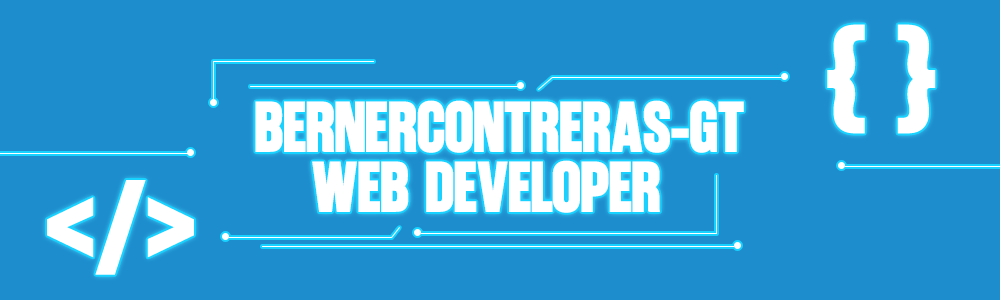

# Welcome to My Portfolio 👋

## About Me
I am a passionate **Web Developer** specialized in building scalable and elegant digital solutions.  
My focus is on creating efficient workflows and user‑friendly applications for clubs, restaurants, and small businesses.  
With a strong background in both frontend and backend development, I aim to deliver secure, maintainable, and visually coherent projects.

## 💻 Technologies I Work With
- **HTML5** – clean and semantic structure  
- **CSS3** – modular and elegant design  
- **JavaScript** – dynamic and interactive interfaces  
- **PHP** – robust backend logic and APIs  
- **WordPress** – customized themes and plugins for business solutions  

## 🚀 What I Do
- Design and implement **CRUD systems** with optimized database structures  
- Develop **modular UIs** with reusable CSS components  
- Integrate **frontend forms** with backend APIs for seamless user experiences  
- Build and customize **WordPress solutions** tailored to client needs  
 
## 📫 Contact
Feel free to connect with me on [GitHub](https://github.com/Bernercontreras-GT) or reach out via email: Bernercontreras@gmail.com
